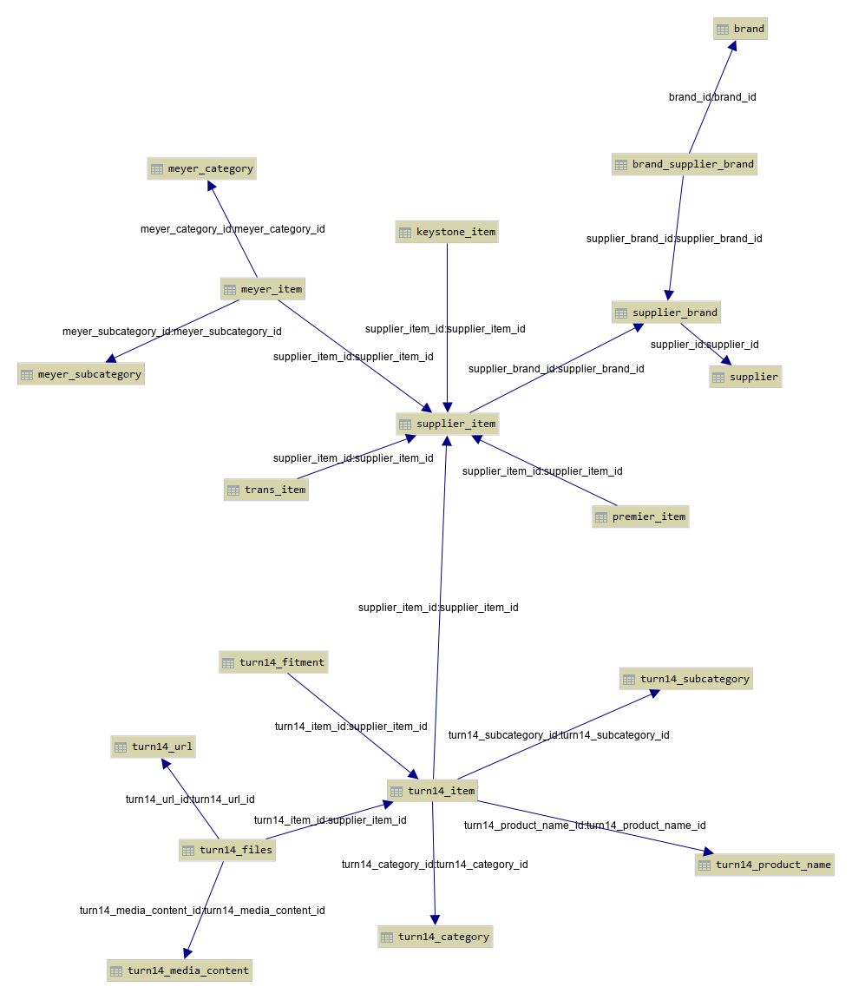

# Example project _supplier-data-collection-subsystem_

_**EXCLUSIVE COPYRIGHT IS OWNED BY STANISLAV AKIMOV.  
NO LICENSE IS OFFERING.**_

## The purpose of posting the project on GitHub

_**To show some example code in Python language developed by me.**_

## Development task

_**Create a subsystem for collecting and storing suppliers' products data.**_

## Suppliers

In the context of the project the suppliers of products data are:

* [Keystone Automotive Operations Inc.](http://www.keystoneautomotive.com/)
* [Transamerican Wholesale LLC.](http://www.transamericanwholesale.com/)
* [Meyer Distributing](https://www.meyerdistributing.com/)
* [Premier Performance](https://premierwd.com/)
* [Turn 14 Distribution](https://www.turn14.com/)

## Data sources

* Files with data on suppliers' FTP-servers
* Suppliers' API
* Files with special offers that come by email

## Implementation

### Database

**MySQL** was selected as a database.

- _19 tables_
- _2 stored procedures_

The **structure** is as follows ([more details](diagrams/suppliers_db.png)):

### Code

Development task is being solved using several Python console applications that are supposed to being run on daily
basis.

<table>
    <tr>
        <th>Python module</th>
        <th>Class diagram</th>
        <th>Description</th>
    </tr>
    <tr>
        <td><a href="api_meyer.py">api_meyer.py</a></td>
        <td><a href="diagrams/api_meyer.png">Show</a></td>
        <td>
            Fills the database using data fetched with Meyer Distributing API.
        </td>
    </tr>
    <tr>
        <td><a href="api_premier.py">api_premier.py</a></td>
        <td><a href="diagrams/api_premier.png">Show</a></td>
        <td>
            Fills the database using data fetched with Premier Performance API.
        </td>
    </tr>
    <tr>
        <td><a href="api_turn14.py">api_turn14.py</a></td>
        <td><a href="diagrams/api_turn14.png">Show</a></td>
        <td>
            Fills the database using data fetched with Turn 14 Distribution API.            
        </td>
    </tr>
    <tr>
        <td><a href="constants.py">constants.py</a></td>
        <td><a href="diagrams/constants.png">Show</a></td>
        <td>
            Contains global constants and helper functions for all modules.
        </td>
    </tr>
    <tr>
        <td><a href="converters.py">converters.py</a></td>
        <td><a href="diagrams/converters.png">Show</a></td>
        <td>
            Contains generic functions and classes required for type conversion and validation of data values.
        </td>
    </tr>
    <tr>
        <td><a href="database.py">database.py</a></td>
        <td><a href="diagrams/database.png">Show</a></td>
        <td>
            Implements an interface for creating the database structure and interacting with 
            the database from any other modules in the project.
        </td>
    </tr>
    <tr>
        <td><a href="items.py">items.py</a></td>
        <td><a href="diagrams/items.png">Show</a></td>
        <td>
            Classes of normalization and verification of all possible elements (records) 
            obtained from any sources. 
        </td>
    </tr>
    <tr>
        <td><a href="parse_suppliers_files.py">parse_suppliers_files.py</a></td>
        <td><a href="diagrams/parse_suppliers_files.png">Show</a></td>
        <td>
            Fills the database using data fetched from files on suppliers' FTP-servers. 
            <i>Because Identical brands of goods from different suppliers have different names, 
            then when entering into the database, an automatic analysis of brand names is performed, 
            taking into account their preliminary manual moderation - <b>depth-first search</b>
            for the longest chains of identical brands.</i>
        </td>
    </tr>
    <tr>
        <td><a href="special_input_trans_file_into_db.py">special_input_trans_file_into_db.py</a></td>
        <td><a href="diagrams/special_input_trans_file_into_db.png">Show</a></td>
        <td>
            Fills the database using data from a file with special offers of Transamerican Wholesale LLC supplier.
        </td>
    </tr>
    <tr>
        <td><a href="special_make_file_with_brand_pairs.py">special_make_file_with_brand_pairs.py</a></td>
        <td><a href="diagrams/special_make_file_with_brand_pairs.png">Show</a></td>
        <td>
            Generates a file with pairs of product brands from different suppliers for manual moderation.
        </td>
    </tr>
    <tr>
        <td>
            <a href="special_make_file_with_name_of_brand_chains.py">special_make_file_with_name_of_brand_chains.py</a>
        </td>
        <td><a href="diagrams/special_make_file_with_name_of_brand_chains.png">Show</a></td>
        <td>
            Generates a file with names and chains of identical brands, which is necessary for entering 
            the correct unique names of product brands into the database.
        </td>           
    </tr>
    <tr>
        <td><a href="special_make_trans_prefixes_dict.py">special_make_trans_prefixes_dict.py</a></td>
        <td></td>
        <td>
            Helper module for Transamerican Wholesale LLC supplier.
        </td>
    </tr>
    <tr>
        <td><a href="suppliers.py">suppliers.py</a></td>
        <td><a href="diagrams/suppliers.png">Show</a></td>
        <td> 
            Classes for handling suppliers' files obtained from FTP servers. 
            Responsible for loading and normalizing them, i.e. casting to csv format and writing in a unified dialect.
        </td>
    </tr>
    <tr>
        <td><a href="trans_prefix_brand.py">trans_prefix_brand.py</a></td>
        <td></td>
        <td>
            Helper module for Transamerican Wholesale LLC supplier.
        </td>
    </tr>
</table>

_**Important note:** in the code all non-public links, usernames and passwords are **changed**!_
